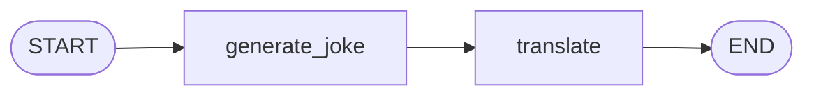

# 第二章 环境搭建与第一个 Graph

---

## 2.1 安装 LangGraph 及相关依赖

### 创建项目环境

动手之前，先给项目一个干净的 Python 虚拟环境。这不是可选步骤——当你同时维护多个 AI 项目时，依赖冲突会让你痛不欲生。

```bash
# 创建项目目录
mkdir langgraph-tutorial && cd langgraph-tutorial

# 创建虚拟环境（推荐 Python 3.11+）
python -m venv .venv

# 激活虚拟环境
# macOS / Linux：
source .venv/bin/activate
# Windows：
.venv\Scripts\activate
```

### 安装核心包

LangGraph 的安装很简单，一行 pip 搞定：

```bash
# 核心包：langgraph 本体
pip install langgraph

# LLM 提供商（按需选装，至少装一个）
pip install langchain-deepseek    # DeepSeek 官方集成
pip install langchain-openai      # OpenAI 兼容接口（通用，支持大多数国内模型）

# 可选：本地模型支持
pip install langchain-ollama      # Ollama 本地模型
```

### 包的关系

初学者常被 `langgraph`、`langchain`、`langchain-core` 这堆包名搞晕。它们的关系其实很清晰：

```
依赖关系（从上到下）：

  ┌─────────────────┐
  │   langgraph      │  ← 你直接安装的包
  │   (图执行引擎)    │
  └────────┬────────┘
           │ 依赖
  ┌────────▼────────┐
  │  langchain-core  │  ← 自动安装，提供基础抽象
  │  (消息/工具/LLM) │     （ChatModel、Tool、Message 等）
  └─────────────────┘

  ┌───────────────────┐
  │ langchain-deepseek │  ← 按需安装，接入具体 LLM
  │ langchain-openai   │    （OpenAI 兼容接口，通用）
  │ langchain-ollama   │
  └───────────────────┘
```

| 包名 | 作用 | 是否必装 |
|------|------|---------|
| `langgraph` | 图执行引擎（State / Node / Edge） | ✅ 必装 |
| `langchain-core` | 基础抽象（Message、Tool 等） | 自动安装 |
| `langchain-deepseek` | 接入 DeepSeek 模型 | 按需 |
| `langchain-openai` | OpenAI 兼容接口（通用） | 按需 |
| `langchain-ollama` | 接入 Ollama 本地模型 | 按需 |
| `langchain` | LangChain 主包（Chain / LCEL） | ❌ 不需要 |

> **注意**：你**不需要**安装 `langchain` 主包。LangGraph 只依赖 `langchain-core`，它是一个轻量的基础包。很多教程把 LangChain 和 LangGraph 混在一起装，这会引入大量你用不到的依赖。

### 验证安装

```python
# 验证 langgraph 安装成功
import langgraph
print(f"LangGraph 版本: {langgraph.__version__}")

# 验证 langchain-core
from langchain_core.messages import HumanMessage
print("langchain-core ✅")

# 验证 LLM 提供商（以 DeepSeek 为例）
from langchain_deepseek import ChatDeepSeek
print("langchain-deepseek ✅")
```

```
预期输出：
LangGraph 版本: 0.4.x
langchain-core ✅
langchain-deepseek ✅
```

> **快速排错**：如果 `import langgraph` 报错，99% 是因为你没激活虚拟环境，或者 Python 版本低于 3.10。LangGraph 要求 Python ≥ 3.10。

---

## 2.2 配置 LLM（DeepSeek / 本地模型）

LangGraph 本身**不关心你用哪个 LLM**——它只是一个执行引擎。具体用什么模型，由你在 Node 函数里决定。但不管用哪个模型，第一步都是配置 API Key。

### 方式一：环境变量（推荐）

最安全的做法是把 API Key 放在环境变量里，而不是硬编码到代码中。

```bash
# 在终端中设置（当前会话有效）
# DeepSeek
export DEEPSEEK_API_KEY="sk-xxxxxxxxxxxxxxxx"

# 或者写入 .env 文件（配合 python-dotenv 使用）
echo 'DEEPSEEK_API_KEY=sk-xxxxxxxxxxxxxxxx' >> .env
```

```python
# 在代码中加载 .env 文件
from dotenv import load_dotenv
load_dotenv()  # 自动读取 .env 文件中的变量

# 别忘了安装：pip install python-dotenv
```

### 方式二：代码中直接传入

如果是快速测试，也可以直接在代码中传 key（不推荐用于生产）：

```python
from langchain_deepseek import ChatDeepSeek

llm = ChatDeepSeek(
    model="deepseek-chat",
    api_key="sk-xxxxxxxx"  # 不推荐硬编码
)
```

### 各 LLM 的初始化方式

| LLM 提供商 | 初始化代码 | 环境变量名 |
|-----------|-----------|-----------|
| DeepSeek | `ChatDeepSeek(model="deepseek-chat")` | `DEEPSEEK_API_KEY` |
| DeepSeek（推理） | `ChatDeepSeek(model="deepseek-reasoner")` | `DEEPSEEK_API_KEY` |
| OpenAI 兼容（通用） | `ChatOpenAI(model="deepseek-chat", base_url="...")` | `OPENAI_API_KEY` |
| Ollama（本地） | `ChatOllama(model="llama3")` | 不需要 key |

```python
# DeepSeek —— 国产大模型，性价比高，支持 Tool Calling
from langchain_deepseek import ChatDeepSeek
llm = ChatDeepSeek(model="deepseek-chat", temperature=0)

# DeepSeek Reasoner —— 适合复杂推理（注意：不支持 Tool Calling）
from langchain_deepseek import ChatDeepSeek
llm = ChatDeepSeek(model="deepseek-reasoner", temperature=0)

# OpenAI 兼容接口 —— 通用方案，大多数国内模型都支持
# DeepSeek、通义千问、智谱、月之暗面等都提供 OpenAI 兼容 API
from langchain_openai import ChatOpenAI
llm = ChatOpenAI(
    model="deepseek-chat",
    base_url="https://api.deepseek.com/v1",
    api_key="sk-xxx"  # 对应平台的 API Key
)

# Ollama —— 完全本地，不花钱
from langchain_ollama import ChatOllama
llm = ChatOllama(model="llama3")
```

> **💡 提示**：`langchain-openai` 是一个**通用方案**——任何提供 OpenAI 兼容 API 的模型（DeepSeek、通义千问、智谱 GLM、月之暗面 Kimi 等）都可以通过设置 `base_url` 接入。如果你不确定选哪个包，装 `langchain-openai` 准没错。

### 快速测试 LLM 连接

配置完成后，先跑一个最简单的测试，确保 LLM 连通：

```python
from langchain_deepseek import ChatDeepSeek
from langchain_core.messages import HumanMessage

llm = ChatDeepSeek(model="deepseek-chat", temperature=0)

# 发一条消息测试
response = llm.invoke([HumanMessage(content="用一个词形容 Python")])
print(response.content)
# 预期输出类似："简洁" 或 "优雅"
```

如果能正常返回结果，说明你的 LLM 配置没问题，可以进入下一节了。

> **关键提醒**：本教程后续代码默认使用 `ChatDeepSeek(model="deepseek-chat")`。如果你换用其他模型，只需修改这一行初始化代码——LangGraph 的图结构代码完全不用改。

---

## 2.3 Hello Graph：构建第一个两节点图

是时候动手了。我们来构建一个最简单的 LangGraph 程序——两个节点，一条边，让你亲眼看到图是怎么运行的。

### 目标

```
用户输入一个话题 → 节点 1: 生成一个笑话 → 节点 2: 翻译成英文 → 输出结果

  START → [generate_joke] → [translate] → END
```

这个例子故意做得很简单——重点不是功能，而是让你理解 LangGraph 的**代码模式**。

### 完整代码

```python
from typing import TypedDict
from langchain_deepseek import ChatDeepSeek
from langchain_core.messages import HumanMessage
from langgraph.graph import StateGraph, START, END

# ====== Step 1: 定义 State ======
class JokeState(TypedDict):
    topic: str       # 用户输入的话题
    joke: str        # 节点 1 生成的笑话
    translation: str  # 节点 2 翻译的结果

# ====== Step 2: 初始化 LLM ======
llm = ChatDeepSeek(model="deepseek-chat", temperature=0.7)

# ====== Step 3: 定义 Node 函数 ======
def generate_joke(state: JokeState) -> dict:
    """节点 1：根据话题生成一个中文笑话"""
    topic = state["topic"]
    response = llm.invoke([
        HumanMessage(content=f"请讲一个关于「{topic}」的冷笑话，要简短。")
    ])
    return {"joke": response.content}

def translate(state: JokeState) -> dict:
    """节点 2：把笑话翻译成英文"""
    joke = state["joke"]
    response = llm.invoke([
        HumanMessage(content=f"请把以下笑话翻译成英文：\n\n{joke}")
    ])
    return {"translation": response.content}

# ====== Step 4: 构建 Graph ======
graph = StateGraph(JokeState)

# 添加节点
graph.add_node("generate_joke", generate_joke)
graph.add_node("translate", translate)

# 添加边（指定执行顺序）
graph.add_edge(START, "generate_joke")     # 入口 → 生成笑话
graph.add_edge("generate_joke", "translate")  # 生成笑话 → 翻译
graph.add_edge("translate", END)            # 翻译 → 结束

# ====== Step 5: 编译并运行 ======
app = graph.compile()

# 执行！
result = app.invoke({"topic": "程序员"})

# 查看结果
print("=== 笑话 ===")
print(result["joke"])
print("\n=== 翻译 ===")
print(result["translation"])
```

### 运行结果

```
=== 笑话 ===
程序员最怕什么？
答：最怕产品经理说"我突然有个小想法"。

=== 翻译 ===
What do programmers fear the most?
Answer: When the product manager says "I suddenly have a small idea."
```

### 代码逐行解析

理解这段代码，你就掌握了 LangGraph 的核心骨架。我们拆开来看：

```
代码结构（5 步模式——所有 LangGraph 程序都长这样）：

  Step 1. 定义 State（TypedDict）
     ↓    → 声明图执行中需要哪些数据字段
  Step 2. 初始化 LLM
     ↓    → 创建你要用的语言模型实例
  Step 3. 定义 Node（普通函数）
     ↓    → 每个函数接收 state，返回要更新的字段
  Step 4. 构建 Graph（StateGraph）
     ↓    → add_node + add_edge 组装图结构
  Step 5. 编译并运行
          → compile() 得到可执行对象，invoke() 传入初始状态
```

**关于 Node 函数的返回值**——这是初学者最容易搞混的地方：

```python
# Node 函数返回的是"要更新的字段"，不是完整 State
def generate_joke(state: JokeState) -> dict:
    return {"joke": response.content}
    # ↑ 只返回 {"joke": "..."}
    # LangGraph 会自动把它合并到 State 中
    # State 变成: {"topic": "程序员", "joke": "...", "translation": ""}

# 你不需要返回整个 State！
# ❌ return {"topic": state["topic"], "joke": "...", "translation": ""}
# ✅ return {"joke": "..."}
```

**关于 `invoke()` 的输入**——你只需要传入初始字段：

```python
# 只传入 topic 就够了，其他字段 LangGraph 会初始化为空
result = app.invoke({"topic": "程序员"})

# invoke() 返回的是最终的完整 State
# result = {"topic": "程序员", "joke": "...", "translation": "..."}
```

> **关键心法**：LangGraph 的代码永远是这「5 步」。后面不管图结构多么复杂——增加条件边、增加循环、增加持久化——你的代码骨架都是：**定义 State → 写 Node → 连 Edge → compile → invoke**。把这个模式刻进肌肉记忆。

---

## 2.4 可视化你的 Graph（Mermaid 图 / LangSmith）

代码写完了，但图的结构只存在于你的脑海中。当图变复杂后（十几个节点、多条条件边），你一定需要**可视化**。LangGraph 提供了开箱即用的方案。

### 方法一：生成 Mermaid 文本

最简单的方式——把图结构转成 Mermaid 语法，直接在支持 Mermaid 的工具中渲染（GitHub、Obsidian、VS Code 等）。

```python
# 接上一节的 app 对象
mermaid_text = app.get_graph().draw_mermaid()
print(mermaid_text)
```

输出的 Mermaid 代码：



把这段代码贴到任何支持 Mermaid 的地方，你就能看到图结构：

```
  START → generate_joke → translate → END
```

### 方法二：生成 PNG 图片

想直接拿到一张图片？用 `draw_mermaid_png()`：

```python
# 需要先安装依赖
# pip install pyppeteer  或  pip install playwright

# 生成 PNG 并保存
png_bytes = app.get_graph().draw_mermaid_png()
with open("my_graph.png", "wb") as f:
    f.write(png_bytes)
print("图片已保存到 my_graph.png")
```

> **提示**：`draw_mermaid_png()` 底层需要一个浏览器引擎来渲染 Mermaid。如果你不想装这些依赖，用方法一生成 Mermaid 文本，然后贴到 Obsidian 或 [mermaid.live](https://mermaid.live) 在线渲染即可。

### 方法三：LangSmith（生产级可观测性）

当你的 Agent 跑在生产环境中时，你需要的不仅是「看图结构」，还要能看到**每次执行的详细轨迹**——每个节点输入了什么、输出了什么、耗时多久、消耗了多少 Token。

这就是 [LangSmith](https://smith.langchain.com/) 的用武之地。

```bash
# 配置 LangSmith（注册后获取 API key）
export LANGSMITH_API_KEY="lsv2-xxxxxxxx"
export LANGSMITH_TRACING=true
export LANGSMITH_PROJECT="langgraph-tutorial"
```

配置好环境变量后，你的 LangGraph 代码**不需要做任何修改**——每次 `invoke()` 或 `stream()` 的执行轨迹都会自动上传到 LangSmith 控制台。

```
LangSmith 能看到什么：

  ┌──────────────────────────────────────────────┐
  │  LangSmith Trace                              │
  │                                               │
  │  ▶ invoke()                        总耗时 2.1s │
  │    ├── generate_joke               1.2s       │
  │    │   ├── Input:  {"topic": "程序员"}          │
  │    │   ├── LLM: deepseek-chat (340 tokens)    │
  │    │   └── Output: {"joke": "..."}            │
  │    │                                          │
  │    └── translate                    0.9s       │
  │        ├── Input:  {"joke": "..."}            │
  │        ├── LLM: deepseek-chat (280 tokens)    │
  │        └── Output: {"translation": "..."}     │
  └──────────────────────────────────────────────┘
```

| 方法 | 依赖 | 适合场景 |
|------|------|---------|
| `draw_mermaid()` | 无 | 开发时快速查看图结构 |
| `draw_mermaid_png()` | pyppeteer / playwright | 导出图片用于文档 |
| LangSmith | 注册账号 + API key | 生产环境调试、性能监控 |

> **建议**：开发阶段用 `draw_mermaid()` 就够了。等你的 Agent 上线后，再接入 LangSmith——它是目前 LLM 应用领域最好的可观测性工具之一。

---

## 本章小结

| 知识点 | 要点 |
|--------|------|
| 安装 | `pip install langgraph` + 按需装 LLM 提供商包 |
| 不需要装 | `langchain` 主包——LangGraph 只依赖 `langchain-core` |
| 配置 LLM | 环境变量设 API Key → 用 `ChatDeepSeek` 初始化 |
| 代码骨架 | 5 步法：State → Node → Edge → compile → invoke |
| Node 返回值 | 只返回要更新的字段，LangGraph 自动合并到 State |
| 可视化 | `draw_mermaid()` 开发调试；LangSmith 生产监控 |

> **下一章预告**：深入 State 机制——用 TypedDict 和 Pydantic 定义 State、Reducer 的消息追加逻辑、MessagesState 对话方案。State 是 LangGraph 最重要的概念，理解它等于理解了 LangGraph 的 50%。


