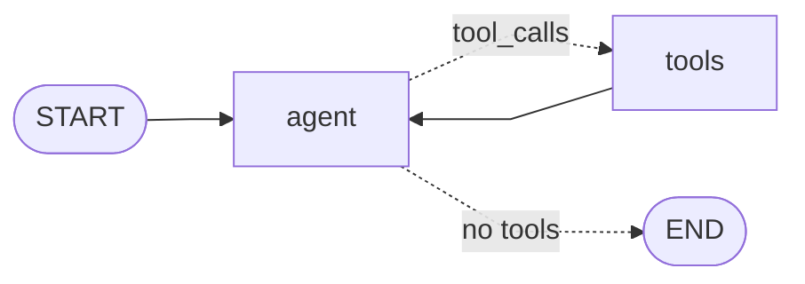

# 第五章 Tool Calling —— 让 Agent 使用工具

---

## 5.1 定义工具（@tool 装饰器）

前面四章，我们的 Agent 只能"说话"——所有 Node 都是调 LLM 生成文本。但一个真正有用的 Agent 需要能**做事**：搜索网页、查数据库、调 API、执行代码……

这就需要**工具（Tool）**。

### 什么是 Tool

在 LangGraph 的世界里，Tool 就是一个**被 LLM 调用的函数**。你定义好函数的名称、参数和描述，LLM 会根据用户的需求，**自主决定**是否调用这个函数、传什么参数。

```
传统编程：
  程序员写代码 → 调用函数 → 得到结果
  谁决定调用？程序员。

Tool Calling：
  用户提问 → LLM 分析需求 → 决定调用哪个工具 → 传入参数 → 得到结果
  谁决定调用？LLM。
```

### 用 @tool 装饰器定义工具

最简单的方式——用 `langchain_core` 提供的 `@tool` 装饰器：

```python
from langchain_core.tools import tool

@tool
def get_weather(city: str) -> str:
    """获取指定城市的天气信息。

    Args:
        city: 城市名称，如 "北京"、"上海"
    """
    # 实际项目中这里会调天气 API
    weather_data = {
        "北京": "晴，25°C",
        "上海": "多云，22°C",
        "深圳": "阵雨，28°C",
    }
    return weather_data.get(city, f"未找到 {city} 的天气信息")

@tool
def calculator(expression: str) -> str:
    """计算数学表达式的结果。

    Args:
        expression: 数学表达式，如 "2 + 3 * 4"
    """
    try:
        result = eval(expression)
        return f"{expression} = {result}"
    except Exception as e:
        return f"计算错误: {e}"
```

### @tool 的关键要素

LLM 靠什么决定是否调用你的工具？靠**函数名 + docstring + 参数类型**：

```
@tool 会从函数中提取三样东西给 LLM：

  ┌─────────────────────────────────────┐
  │  工具名称: get_weather               │  ← 函数名
  │  工具描述: "获取指定城市的天气信息"    │  ← docstring 第一行
  │  参数:                               │
  │    city (str): "城市名称，如北京"     │  ← 类型注解 + docstring
  └─────────────────────────────────────┘

  LLM 看到这些信息后，当用户问 "北京天气怎么样"，
  它就知道该调用 get_weather(city="北京")
```

| 要素 | 来源 | 重要性 |
|------|------|--------|
| 工具名称 | 函数名 | ⭐⭐⭐ LLM 靠名字理解工具用途 |
| 工具描述 | docstring | ⭐⭐⭐ LLM 靠描述决定是否使用 |
| 参数类型 | 类型注解 | ⭐⭐⭐ LLM 靠类型知道传什么值 |
| 参数描述 | docstring Args | ⭐⭐ 帮助 LLM 理解参数含义 |

> **铁律**：工具的 docstring **必须写好**。这不是给人看的注释——这是给 LLM 看的"使用说明书"。描述越清晰，LLM 调用越准确。

### 把工具绑定到 LLM

定义好工具后，需要告诉 LLM "你可以使用这些工具"：

```python
from langchain_deepseek import ChatDeepSeek

llm = ChatDeepSeek(model="deepseek-chat", temperature=0)

# 把工具绑定到 LLM
tools = [get_weather, calculator]
llm_with_tools = llm.bind_tools(tools)
```

`bind_tools` 之后，LLM 的回复可能包含**工具调用请求**（而不仅仅是文本）：

```python
from langchain_core.messages import HumanMessage

# 不需要工具的问题 → 直接回答文本
response = llm_with_tools.invoke([HumanMessage(content="你好")])
print(response.content)        # "你好！有什么可以帮你的？"
print(response.tool_calls)     # []  ← 没有工具调用

# 需要工具的问题 → 返回工具调用请求
response = llm_with_tools.invoke([HumanMessage(content="北京天气怎么样？")])
print(response.content)        # ""  ← 内容为空
print(response.tool_calls)     # [{"name": "get_weather", "args": {"city": "北京"}}]
```

```
LLM 的两种回复模式：

  用户: "你好"
  LLM:  content="你好！"         ← 纯文本回复
        tool_calls=[]

  用户: "北京天气怎么样？"
  LLM:  content=""               ← 内容为空
        tool_calls=[{            ← 工具调用请求
          name: "get_weather",
          args: {"city": "北京"},
          id: "call_xxx"
        }]

  注意：LLM 只是"请求调用"，并没有真正执行工具！
  执行工具的活儿，交给下一节的 ToolNode。
```

> **关键认知**：`bind_tools` 之后，LLM 有了"要不要用工具"的**选择权**。它会根据用户问题自行判断——这就是 Agent 的"智能"所在。

---

## 5.2 ToolNode —— 自动执行工具调用

上一节我们看到，`bind_tools` 后的 LLM 会返回 `tool_calls`——但 LLM 只是"请求"调用工具，它不会真正去执行。谁来执行？**ToolNode**。

### ToolNode 的作用

```
LLM 返出的 tool_calls:
  [{"name": "get_weather", "args": {"city": "北京"}, "id": "call_abc"}]
         │
         ↓
  ┌──────────────────┐
  │    ToolNode       │
  │                  │
  │  1. 解析 tool_calls│
  │  2. 找到对应函数   │
  │  3. 执行函数       │
  │  4. 把结果包装成   │
  │     ToolMessage   │
  └──────────────────┘
         │
         ↓
  ToolMessage(content="晴，25°C", tool_call_id="call_abc")
```

### 使用 ToolNode

```python
from langgraph.prebuilt import ToolNode

# 把工具列表传给 ToolNode
tools = [get_weather, calculator]
tool_node = ToolNode(tools)

# 注册为图中的一个节点
graph.add_node("tools", tool_node)
```

就这么简单。`ToolNode` 会：
1. 读取 State 中最新消息的 `tool_calls`
2. 根据 `name` 找到对应的工具函数
3. 用 `args` 执行该函数
4. 把结果包装成 `ToolMessage` 追加到 `messages`

### ToolMessage 是什么

当工具执行完毕后，结果会被包装成 `ToolMessage`——这是 LangChain 消息体系中的一种特殊消息类型：

```
LangChain 的消息类型：

  HumanMessage   → 用户说的话
  AIMessage      → LLM 的回复（可能包含 tool_calls）
  ToolMessage    → 工具执行的结果
  SystemMessage  → 系统提示词

  一轮完整的工具调用对话：
  ┌──────────────────────────────────────────┐
  │ HumanMessage:  "北京天气怎么样？"          │
  │ AIMessage:     tool_calls=[get_weather]   │
  │ ToolMessage:   "晴，25°C"（工具结果）      │
  │ AIMessage:     "北京今天天气晴朗，25°C"    │  ← LLM 看到工具结果后组织回答
  └──────────────────────────────────────────┘
```

### 手动构建 vs ToolNode

你也可以不用 `ToolNode`，自己手写工具执行逻辑：

```python
# 手动方式（啰嗦但灵活）
def execute_tools(state):
    last_message = state["messages"][-1]
    results = []
    for tool_call in last_message.tool_calls:
        if tool_call["name"] == "get_weather":
            result = get_weather.invoke(tool_call["args"])
        elif tool_call["name"] == "calculator":
            result = calculator.invoke(tool_call["args"])
        results.append(ToolMessage(
            content=str(result),
            tool_call_id=tool_call["id"]
        ))
    return {"messages": results}

# ToolNode 方式（一行搞定）
tool_node = ToolNode([get_weather, calculator])
```

> **推荐**：除非你需要在工具执行前后加自定义逻辑（日志、权限检查等），否则直接用 `ToolNode`——它帮你处理了所有样板代码。

---

## 5.3 ReAct 模式：思考 → 调用工具 → 观察 → 再思考

现在我们有了所有拼图碎片：绑定工具的 LLM + ToolNode + 条件边。把它们组合在一起，就得到了 AI Agent 最经典的模式——**ReAct**。

### ReAct 是什么

ReAct = **Re**asoning + **Act**ing（推理 + 行动）。它的核心思想是让 LLM 在一个循环中交替进行"思考"和"行动"：

```
ReAct 循环：

  用户提问
      │
      ↓
  ┌─────────┐
  │  Agent   │ ← LLM 思考：需要工具吗？
  └────┬─────┘
       │
       ├── 有 tool_calls ──→ ┌─────────┐
       │                      │  Tools  │ ← 执行工具
       │                      └────┬────┘
       │                           │
       │    ┌──────────────────────┘
       │    │ (工具结果回到消息列表)
       │    ↓
       │  回到 Agent（再次思考）
       │
       └── 无 tool_calls ──→ END（直接回答用户）
```

### 用 LangGraph 实现 ReAct

```python
from langgraph.graph import StateGraph, MessagesState, START, END
from langgraph.prebuilt import ToolNode
from langchain_deepseek import ChatDeepSeek

# 1. 工具和 LLM
tools = [get_weather, calculator]
llm = ChatDeepSeek(model="deepseek-chat", temperature=0).bind_tools(tools)

# 2. Agent 节点
def agent(state: MessagesState):
    response = llm.invoke(state["messages"])
    return {"messages": [response]}

# 3. 路由函数：检查是否需要调用工具
def should_continue(state: MessagesState):
    last_message = state["messages"][-1]
    if last_message.tool_calls:
        return "tools"
    return END

# 4. 构建图
graph = StateGraph(MessagesState)
graph.add_node("agent", agent)
graph.add_node("tools", ToolNode(tools))

graph.add_edge(START, "agent")
graph.add_conditional_edges("agent", should_continue)
graph.add_edge("tools", "agent")  # 工具执行完 → 回到 Agent

app = graph.compile()
```

### 执行流程详解

```
用户问: "北京天气怎么样？如果温度超过 20 度，帮我算 25 * 1.8 + 32"

第 1 轮循环：
  Agent 思考 → "需要先查天气" → tool_calls: [get_weather("北京")]
  Tools 执行 → ToolMessage: "晴，25°C"
  → 回到 Agent

第 2 轮循环：
  Agent 思考 → "25 > 20，需要计算" → tool_calls: [calculator("25 * 1.8 + 32")]
  Tools 执行 → ToolMessage: "25 * 1.8 + 32 = 77.0"
  → 回到 Agent

第 3 轮循环：
  Agent 思考 → "两个工具都执行完了，可以回答了"
  → 无 tool_calls → 直接回答 → END

  messages 列表最终包含：
  ┌──────────────────────────────────────────────────────┐
  │ 1. HumanMessage: "北京天气怎么样？如果..."             │
  │ 2. AIMessage:    tool_calls=[get_weather]              │
  │ 3. ToolMessage:  "晴，25°C"                           │
  │ 4. AIMessage:    tool_calls=[calculator]               │
  │ 5. ToolMessage:  "25 * 1.8 + 32 = 77.0"              │
  │ 6. AIMessage:    "北京今天晴，25°C。华氏温度是 77°F"   │
  └──────────────────────────────────────────────────────┘
```

### 预构建的 ReAct Agent

上面的模式太常用了，LangGraph 提供了一行代码搞定的版本：

```python
from langgraph.prebuilt import create_react_agent

# 一行创建完整的 ReAct Agent
app = create_react_agent(
    model=ChatDeepSeek(model="deepseek-chat", temperature=0),
    tools=[get_weather, calculator],
)

# 直接用
result = app.invoke({
    "messages": [("user", "北京天气怎么样？")]
})
```

| 方式 | 代码量 | 灵活性 | 适合场景 |
|------|--------|--------|---------|
| 手动构建 | ~20 行 | ⭐⭐⭐ 完全控制 | 需要自定义逻辑 |
| `create_react_agent` | 1 行 | ⭐ 有限 | 快速原型、标准 Agent |

> **建议**：先用 `create_react_agent` 快速验证想法。当你需要加入自定义节点（RAG、人工审批、多 Agent 协作）时，再切换到手动构建——因为你已经理解了底层原理。

---

## 5.4 实战：构建一个能搜索 + 计算的 Agent

现在把前面学的所有知识组合起来，手动构建一个完整的、带工具的 ReAct Agent。

### 完整代码

```python
from typing import Annotated
import operator
from langchain_deepseek import ChatDeepSeek
from langchain_core.tools import tool
from langchain_core.messages import HumanMessage, SystemMessage
from langgraph.graph import StateGraph, MessagesState, START, END
from langgraph.prebuilt import ToolNode

# ====== Step 1: 定义工具 ======
@tool
def search_web(query: str) -> str:
    """在网上搜索信息。当你需要查找最新资讯、人物介绍、概念解释时使用。

    Args:
        query: 搜索关键词
    """
    # 模拟搜索结果（实际项目中接入搜索 API）
    mock_results = {
        "LangGraph": "LangGraph 是 LangChain 团队推出的 AI Agent 编排框架，基于图结构，支持循环、持久化和人工介入。",
        "Python 3.12": "Python 3.12 于 2023 年 10 月发布，主要特性包括更好的错误提示、f-string 改进和性能优化。",
    }
    for key, value in mock_results.items():
        if key.lower() in query.lower():
            return value
    return f"搜索 '{query}' 未找到相关结果。"

@tool
def calculator(expression: str) -> str:
    """计算数学表达式。支持加减乘除、幂运算、括号等。

    Args:
        expression: 数学表达式，如 "2**10" 或 "(3+4)*5"
    """
    try:
        result = eval(expression)
        return f"{expression} = {result}"
    except Exception as e:
        return f"计算错误: {e}"

# ====== Step 2: 初始化 LLM（绑定工具）======
tools = [search_web, calculator]
llm = ChatDeepSeek(model="deepseek-chat", temperature=0).bind_tools(tools)

# ====== Step 3: 定义 Node 函数 ======
def agent(state: MessagesState) -> dict:
    """Agent 节点：调用绑定了工具的 LLM"""
    system_prompt = SystemMessage(content=(
        "你是一个有用的助手，可以搜索网页和做数学计算。"
        "请根据用户的问题，合理使用工具来回答。"
        "如果不需要工具，直接回答即可。"
    ))
    response = llm.invoke([system_prompt] + state["messages"])
    return {"messages": [response]}

# ====== Step 4: 路由函数 ======
def should_continue(state: MessagesState) -> str:
    """检查 LLM 是否请求了工具调用"""
    last_message = state["messages"][-1]
    if last_message.tool_calls:
        return "tools"
    return END

# ====== Step 5: 构建 Graph ======
graph = StateGraph(MessagesState)

graph.add_node("agent", agent)
graph.add_node("tools", ToolNode(tools))

graph.add_edge(START, "agent")
graph.add_conditional_edges("agent", should_continue)
graph.add_edge("tools", "agent")  # 工具执行完回到 Agent

app = graph.compile()

# ====== Step 6: 运行测试 ======
print("=== 测试 1：需要搜索 ===")
result = app.invoke({
    "messages": [HumanMessage(content="LangGraph 是什么？")]
})
print(result["messages"][-1].content)

print("\n=== 测试 2：需要计算 ===")
result = app.invoke({
    "messages": [HumanMessage(content="2 的 10 次方等于多少？")]
})
print(result["messages"][-1].content)

print("\n=== 测试 3：搜索 + 计算 ===")
result = app.invoke({
    "messages": [HumanMessage(content="Python 3.12 是什么时候发布的？距今多少个月了？")]
})
print(result["messages"][-1].content)

print("\n=== 测试 4：不需要工具 ===")
result = app.invoke({
    "messages": [HumanMessage(content="你好，今天真是美好的一天！")]
})
print(result["messages"][-1].content)
```

### 运行结果

```
=== 测试 1：需要搜索 ===
LangGraph 是 LangChain 团队推出的 AI Agent 编排框架，它基于图结构，
支持循环、持久化和人工介入，让你可以构建有状态的多步骤 AI Agent。

=== 测试 2：需要计算 ===
2 的 10 次方等于 1024。

=== 测试 3：搜索 + 计算 ===
Python 3.12 于 2023 年 10 月发布。距今大约 30 个月了。

=== 测试 4：不需要工具 ===
你好！是的，美好的一天就该享受好心情 😊 有什么我可以帮你的吗？
```

### 图结构



> **里程碑**：恭喜！你已经构建了一个完整的 ReAct Agent。它能理解问题、自主选择工具、执行工具、根据结果继续思考或回答。这就是 LangGraph 的核心价值所在。

---

## 5.5 工具错误处理与重试策略

工具调用不是总能成功——API 超时、参数格式错误、外部服务不可用……在生产环境中，健壮的错误处理是必不可少的。

### 工具内部的错误处理

最简单的方式——在工具函数内部 try-catch，返回错误信息而不是抛异常：

```python
@tool
def search_web(query: str) -> str:
    """搜索网页信息。"""
    try:
        response = requests.get(f"https://api.search.com/q={query}", timeout=5)
        response.raise_for_status()
        return response.json()["result"]
    except requests.Timeout:
        return "搜索超时，请稍后重试。"
    except requests.HTTPError as e:
        return f"搜索服务返回错误: {e}"
    except Exception as e:
        return f"搜索失败: {e}"
```

```
为什么返回错误信息而不是抛异常？

  抛异常 → 整个图执行中断 → 用户得到一个报错
  返回错误信息 → LLM 看到 "搜索失败" → 可以换个方式回答或重试

  让 LLM 自己处理错误，比直接崩溃好得多！
```

### ToolNode 的内置错误处理

`ToolNode` 有一个 `handle_tool_errors` 参数，可以自动捕获工具异常：

```python
from langgraph.prebuilt import ToolNode

# 开启错误处理（默认就是 True）
tool_node = ToolNode(tools, handle_tool_errors=True)

# 工具抛异常时，ToolNode 会自动把异常信息包装成 ToolMessage
# LLM 收到错误信息后，可以决定重试或换个方式回答
```

```
handle_tool_errors=True 时的行为：

  工具抛 ValueError("参数格式错误")
      │
      ↓
  ToolNode 捕获异常
      │
      ↓
  生成 ToolMessage(content="Error: 参数格式错误")
      │
      ↓
  LLM 看到错误 → "我传的参数有问题，换个格式试试"
      │
      ↓
  重新生成 tool_calls（修正参数）→ 再次执行工具
```

### 限制循环次数

ReAct 循环有一个隐患——如果工具一直出错，LLM 一直重试，就会陷入**无限循环**。用 `recursion_limit` 来兜底：

```python
# 设置最大递归深度（默认 25）
app = graph.compile()

result = app.invoke(
    {"messages": [HumanMessage(content="...")]},
    config={"recursion_limit": 10}  # 最多执行 10 步
)
```

```
recursion_limit 是什么：

  每个节点执行一次 = 消耗 1 步
  Agent → Tools → Agent → Tools → Agent → END
    1       2       3       4       5     = 5 步

  如果 recursion_limit = 10，最多循环 5 次
  如果超出限制 → 抛 GraphRecursionError
```

### 自定义重试逻辑

需要更精细的重试控制？在 Node 里自己实现：

```python
def agent_with_retry(state: MessagesState) -> dict:
    """带重试计数的 Agent 节点"""
    # 检查是否有太多连续的工具错误
    error_count = 0
    for msg in reversed(state["messages"]):
        if hasattr(msg, "content") and "Error:" in str(msg.content):
            error_count += 1
        else:
            break

    if error_count >= 3:
        # 连续 3 次工具错误，放弃使用工具，直接回答
        response = llm_without_tools.invoke(state["messages"])
    else:
        response = llm_with_tools.invoke(state["messages"])

    return {"messages": [response]}
```

### 错误处理最佳实践

| 策略 | 适用场景 | 实现方式 |
|------|---------|---------|
| 工具内 try-catch | 所有场景 | 工具函数内返回错误字符串 |
| `handle_tool_errors` | 通用保护 | ToolNode 参数设为 True |
| `recursion_limit` | 防无限循环 | invoke 的 config 参数 |
| 自定义重试计数 | 精细控制 | Node 函数内检查错误次数 |
| Fallback LLM | 高可用 | 主模型失败时切换备用模型 |

> **生产忠告**：永远设 `recursion_limit`。一个失控的 Agent 循环能在几分钟内烧掉大量 API 额度。在生产环境中，10-15 是一个合理的上限。

---

## 本章小结

| 知识点 | 要点 |
|--------|------|
| @tool 装饰器 | 用函数名 + docstring + 类型注解定义工具 |
| bind_tools | 让 LLM 知道有哪些工具可用 |
| tool_calls | LLM 的工具调用请求（不是执行！） |
| ToolNode | 自动执行 tool_calls，返回 ToolMessage |
| ReAct 模式 | Agent → 有 tool_calls? → Tools → 回 Agent（循环） |
| create_react_agent | 一行代码创建标准 ReAct Agent |
| 错误处理 | 工具内 try-catch + handle_tool_errors + recursion_limit |

> **下一章预告**：持久化与检查点 —— 让 Agent 学会"存档/读档"。MemorySaver、SQLite 持久化、thread_id 多轮对话管理、历史状态回溯。


