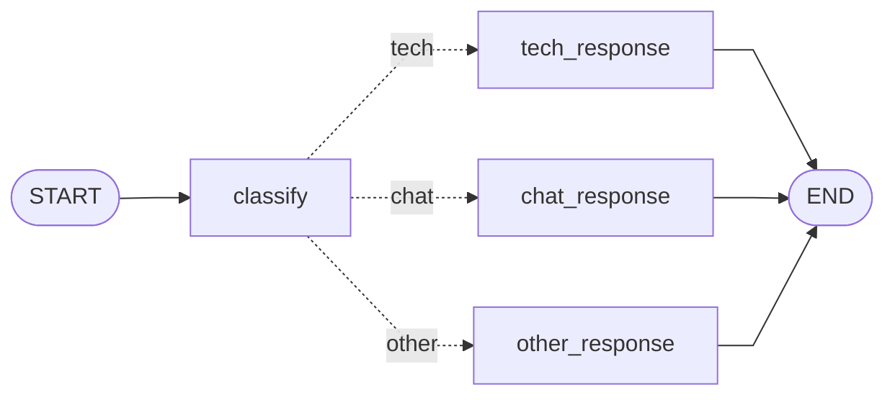

# 第四章 Node 与 Edge —— 图的骨架

---

## 4.1 Node：就是一个普通 Python 函数

上一章我们深入学习了 State。现在来看图的第二个核心组件——**Node（节点）**。

好消息是：Node 没有任何神秘之处。它就是一个**接收 State、返回更新**的普通 Python 函数。

### Node 的基本形态

```python
def my_node(state: MyState) -> dict:
    """一个标准的 Node 函数"""
    # 1. 从 state 中读取需要的数据
    data = state["some_field"]

    # 2. 做任何你想做的事
    result = process(data)

    # 3. 返回要更新的 State 字段
    return {"some_field": result}
```

就这三步。没有继承基类、没有装饰器、没有注册机制。

```
Node 函数的契约：

  输入：state（当前的完整 State 字典）
            │
            ↓
  ┌─────────────────────┐
  │   你的业务逻辑        │
  │   - 调 LLM           │
  │   - 查数据库          │
  │   - 调 API           │
  │   - 任何 Python 代码  │
  └─────────────────────┘
            │
            ↓
  输出：dict（要更新的字段）
        或 Command 对象（高级用法）
```

### Node 里可以做什么

答案是：**任何事**。Node 只是一个普通函数，你可以在里面写任何 Python 代码。

```python
# 调 LLM
def llm_node(state):
    response = llm.invoke(state["messages"])
    return {"messages": [response]}

# 调 API
def search_node(state):
    results = requests.get(f"https://api.example.com/search?q={state['query']}")
    return {"search_results": results.json()}

# 纯逻辑计算
def counter_node(state):
    return {"step_count": state["step_count"] + 1}

# 什么都不做（透传）
def passthrough(state):
    return {}  # 返回空字典 = 不更新任何字段
```

### 注册 Node 到 Graph

写完函数后，用 `add_node` 注册到图中：

```python
graph = StateGraph(MyState)

# 方式 1：指定名字（推荐）
graph.add_node("agent", agent_node)
graph.add_node("tools", tools_node)

# 方式 2：不指定名字，自动用函数名
graph.add_node(agent_node)    # 名字自动为 "agent_node"
graph.add_node(tools_node)    # 名字自动为 "tools_node"
```

| 参数 | 说明 |
|------|------|
| 第一个参数 | 节点名称（字符串），在图中唯一标识该节点 |
| 第二个参数 | 节点函数（callable） |

> **命名建议**：节点名用**动词短语**——`"generate"`, `"search"`, `"evaluate"`, `"respond"`。不要用 `"node1"`, `"step2"` 这种无意义的名字，否则图一复杂你就分不清谁是谁。

### 异步 Node

如果你的节点需要做 I/O 密集操作（API 调用、数据库查询），用 `async def` 可以获得更好的性能：

```python
async def async_search(state):
    """异步节点：不阻塞事件循环"""
    async with aiohttp.ClientSession() as session:
        async with session.get(f"https://api.example.com/search?q={state['query']}") as resp:
            results = await resp.json()
    return {"search_results": results}

# 注册方式完全一样
graph.add_node("search", async_search)

# 运行时用 ainvoke
result = await app.ainvoke({"query": "LangGraph"})
```

> **关键认知**：Node 的简单性是刻意设计的。LangGraph 的哲学是"Low-level"——它不在 Node 层做任何黑盒封装，把完全的控制力留给你。你可以在 Node 里写任何逻辑，LangGraph 只负责**按图结构调度这些 Node**。

---

## 4.2 Edge：节点之间的连线

如果说 Node 是图中的"工位"，那 Edge 就是工位之间的"传送带"——它决定了任务流的走向。

### 普通边（Normal Edge）

最简单的边——"A 执行完后，一定去 B"。

```python
# A 执行完后去 B
graph.add_edge("A", "B")

# 可以链式连接多个
graph.add_edge(START, "fetch")
graph.add_edge("fetch", "process")
graph.add_edge("process", "save")
graph.add_edge("save", END)
```

```
普通边构成的线性流水线：

  START → [fetch] → [process] → [save] → END

  这和 LangChain 的 Chain 效果一样——单向、无分支。
  但 LangGraph 的真正威力在于下一节的条件边。
```

### 一个节点可以有多条出边吗？

**可以，但要注意规则**：

```
✅ 合法：一个节点的输出指向多个节点（并行分支）
  graph.add_edge("A", "B")
  graph.add_edge("A", "C")
  → A 执行完后，B 和 C 会并行执行

✅ 合法：多个节点指向同一个节点（汇聚）
  graph.add_edge("B", "D")
  graph.add_edge("C", "D")
  → B 和 C 都执行完后，D 才会执行

❌ 不合法：同一个节点既有普通边又有条件边
  graph.add_edge("A", "B")
  graph.add_conditional_edges("A", route_fn)
  → 会报错！一个节点只能有一种出边方式
```

### 并行执行（Fan-out / Fan-in）

当一个节点有多条普通出边时，LangGraph 会**并行执行**所有下游节点：

```python
# A 执行完后，B 和 C 并行执行
graph.add_edge("A", "B")
graph.add_edge("A", "C")

# B 和 C 都完成后，汇聚到 D
graph.add_edge("B", "D")
graph.add_edge("C", "D")
```

```
Fan-out / Fan-in 模式：

  ┌────────┐
  │   A    │
  └───┬────┘
      │
   ┌──┴──┐
   ↓     ↓
┌────┐ ┌────┐
│ B  │ │ C  │   ← 并行执行
└──┬─┘ └─┬──┘
   │     │
   └──┬──┘
      ↓
  ┌────────┐
  │   D    │   ← 等 B、C 都完成后执行
  └────────┘
```

> **注意**：并行执行的节点如果同时修改 State 的同一个字段，需要该字段有 **Reducer**（如 `operator.add`），否则后执行的节点会覆盖先执行的结果。

---

## 4.3 条件边（Conditional Edge）—— 让 Agent 做决策

普通边是"无脑直走"，条件边是"看路况决定走哪条路"。这是 LangGraph 区别于线性 Chain 的**最核心特性**。

### 基本概念

```
普通边：A → B（无条件，每次都走）

条件边：A → 路由函数 → 根据返回值决定去哪
                        ├── "option_1" → B
                        ├── "option_2" → C
                        └── "option_3" → END
```

### 语法

```python
# 1. 定义路由函数
def route_decision(state) -> str:
    """根据 State 内容决定下一步去哪个节点"""
    if state["needs_tool"]:
        return "tools"      # 返回节点名
    else:
        return "respond"    # 返回节点名

# 2. 注册条件边
graph.add_conditional_edges(
    "agent",           # 源节点：从哪个节点出发
    route_decision     # 路由函数：返回目标节点名
)
```

`add_conditional_edges` 的参数：

| 参数 | 说明 |
|------|------|
| 第 1 个 | 源节点名（字符串） |
| 第 2 个 | 路由函数（接收 state，返回节点名字符串） |
| 第 3 个（可选） | 路由映射字典 `{"返回值": "目标节点名"}` |

### 路由映射（可选的第三个参数）

路由函数可以直接返回节点名，也可以返回一个"标签"，再通过映射字典转换：

```python
# 方式 1：直接返回节点名（简洁）
def router(state):
    if state["score"] > 0.8:
        return "accept"    # 直接就是节点名
    return "reject"        # 直接就是节点名

graph.add_conditional_edges("evaluate", router)

# 方式 2：返回标签 + 映射字典（灵活，路由逻辑和节点名解耦）
def router(state):
    if state["score"] > 0.8:
        return "good"      # 返回标签
    return "bad"           # 返回标签

graph.add_conditional_edges("evaluate", router, {
    "good": "accept",     # "good" 标签 → 去 accept 节点
    "bad": "reject",      # "bad" 标签  → 去 reject 节点
})
```

### 条件边 + 循环 = Agent 的核心模式

条件边最强大的应用是**构建循环**——这就是 ReAct Agent 的核心模式：

```python
def should_continue(state):
    """检查 LLM 的最新回复中是否有工具调用"""
    last_message = state["messages"][-1]
    if last_message.tool_calls:
        return "tools"     # 有工具调用 → 去执行工具
    return END             # 没有工具调用 → 结束

graph.add_conditional_edges("agent", should_continue)
graph.add_edge("tools", "agent")  # 工具执行完 → 回到 agent（循环！）
```

```
ReAct 循环（AI Agent 最常见的模式）：

  START → [Agent] → 有工具调用吗？
              ↑         ├── 是 → [Tools] ──┐
              │         └── 否 → END       │
              │                            │
              └────────────────────────────┘
              (用完工具回 Agent，再次判断)

  这个循环会一直转，直到 Agent 觉得不再需要工具为止。
```

### 条件边的常见陷阱

```
⚠️ 陷阱 1：路由函数返回了不存在的节点名
  def router(state):
      return "nonexistent_node"  # 这个节点没注册！
  → 运行时报错

⚠️ 陷阱 2：忘记处理所有可能的情况
  def router(state):
      if state["type"] == "A":
          return "node_a"
      # 如果 type 不是 "A" 呢？没有 return！
  → 返回 None，运行时报错

✅ 安全写法：
  def router(state):
      if state["type"] == "A":
          return "node_a"
      elif state["type"] == "B":
          return "node_b"
      else:
          return END  # 兜底！
```

> **核心洞察**：条件边 = LLM 的"决策能力"在图结构中的体现。没有条件边，图就是死板的流水线；有了条件边，图就变成了一个会思考、会选择的 Agent。

---

## 4.4 START 和 END：入口与出口

每个 LangGraph 图都必须有明确的**起点**和**终点**。它们由两个特殊常量表示。

### START —— 图的入口

`START` 不是一个真正的节点——它是一个**虚拟起点**，代表 `invoke()` 传入的初始 State。你用 `add_edge(START, ...)` 来指定"图从哪个节点开始执行"。

```python
from langgraph.graph import START

# 图从 "agent" 节点开始
graph.add_edge(START, "agent")

# 也可以从 START 出发做条件路由
graph.add_conditional_edges(START, initial_router)
```

```
START 的本质：

  invoke({"messages": [...]})  ←  用户传入的初始 State
          │
          │  等价于
          ↓
        START
          │
          ↓
      第一个节点
```

### END —— 图的出口

`END` 也是虚拟节点，代表"图执行结束"。当执行流到达 END，`invoke()` 返回最终的 State。

```python
from langgraph.graph import END

# 直接结束
graph.add_edge("respond", END)

# 条件结束（更常见）
def should_end(state):
    if state["is_complete"]:
        return END
    return "continue_processing"

graph.add_conditional_edges("check", should_end)
```

### 多入口和多出口

```
✅ 多出口（常见）：
  不同分支可以各自到达 END
  graph.add_edge("branch_a", END)
  graph.add_edge("branch_b", END)

✅ 条件出口（最常见）：
  graph.add_conditional_edges("agent", router)
  # router 返回 END 时结束

⚠️ 多入口（可以但少见）：
  graph.add_edge(START, "node_a")
  graph.add_edge(START, "node_b")  # a 和 b 并行执行
```

### 常见错误

```python
# ❌ 忘记连接 START
graph.add_node("agent", agent_fn)
graph.add_edge("agent", END)
# compile() 时报错：图没有入口！

# ❌ 图中有节点无法到达 END（死路）
graph.add_edge(START, "a")
graph.add_edge("a", "b")
# b 节点没有出边 → compile() 可能报警
# 但如果 b 有条件边指向 END 就没问题

# ✅ 正确的最小图
graph.add_edge(START, "process")
graph.add_edge("process", END)
```

> **最佳实践**：用 `draw_mermaid()` 可视化你的图，检查是否所有路径都能到达 END。如果有"死胡同"节点（进得去出不来），你的 Agent 会在那里永远卡住。

---

## 4.5 实战：构建一个带分支的问答路由器

前面都是概念，现在来写一个**有实际意义的完整例子**——一个智能问答路由器，根据用户问题的类型，走不同的处理流程。

### 需求

```
用户输入一个问题 → LLM 分类问题类型 → 根据类型走不同分支：
  ├── "技术问题" → 用专业语气回答
  ├── "闲聊"     → 用轻松语气回答
  └── "其他"     → 用通用语气回答

  START → [classify] →──── "tech"   → [tech_response]  → END
                      ├── "chat"   → [chat_response]  → END
                      └── "other"  → [other_response] → END
```

### 完整代码

```python
from typing import TypedDict, Annotated
import operator
from langchain_deepseek import ChatDeepSeek
from langchain_core.messages import HumanMessage, SystemMessage
from langgraph.graph import StateGraph, START, END

# ====== Step 1: 定义 State ======
class RouterState(TypedDict):
    messages: Annotated[list, operator.add]
    question: str           # 用户的原始问题
    category: str           # 分类结果：tech / chat / other
    response: str           # 最终回答

# ====== Step 2: 初始化 LLM ======
llm = ChatDeepSeek(model="deepseek-chat", temperature=0)

# ====== Step 3: 定义 Node 函数 ======
def classify(state: RouterState) -> dict:
    """分类节点：判断问题类型"""
    question = state["question"]
    response = llm.invoke([
        SystemMessage(content="""请判断用户问题的类型，只返回以下三个标签之一：
        - tech：技术问题（编程、软件、AI 等）
        - chat：闲聊（打招呼、聊天气、讲笑话等）
        - other：其他"""),
        HumanMessage(content=question)
    ])
    category = response.content.strip().lower()
    return {"category": category}

def tech_response(state: RouterState) -> dict:
    """技术问题回答节点"""
    response = llm.invoke([
        SystemMessage(content="你是一个专业的技术顾问。用准确、专业的语气回答。"),
        HumanMessage(content=state["question"])
    ])
    return {"response": response.content}

def chat_response(state: RouterState) -> dict:
    """闲聊回答节点"""
    response = llm.invoke([
        SystemMessage(content="你是一个有趣的聊天伙伴。用轻松、幽默的语气回答。"),
        HumanMessage(content=state["question"])
    ])
    return {"response": response.content}

def other_response(state: RouterState) -> dict:
    """通用回答节点"""
    response = llm.invoke([
        SystemMessage(content="你是一个友好的助手。用通用、友好的语气回答。"),
        HumanMessage(content=state["question"])
    ])
    return {"response": response.content}

# ====== Step 4: 路由函数 ======
def route_question(state: RouterState) -> str:
    """根据分类结果路由到不同节点"""
    category = state["category"]
    if "tech" in category:
        return "tech_response"
    elif "chat" in category:
        return "chat_response"
    else:
        return "other_response"

# ====== Step 5: 构建 Graph ======
graph = StateGraph(RouterState)

# 添加节点
graph.add_node("classify", classify)
graph.add_node("tech_response", tech_response)
graph.add_node("chat_response", chat_response)
graph.add_node("other_response", other_response)

# 添加边
graph.add_edge(START, "classify")
graph.add_conditional_edges("classify", route_question)  # 条件边！
graph.add_edge("tech_response", END)
graph.add_edge("chat_response", END)
graph.add_edge("other_response", END)

# ====== Step 6: 编译并运行 ======
app = graph.compile()

# 测试不同类型的问题
questions = [
    "Python 的 GIL 是什么？",
    "今天心情不错，聊聊天呗！",
    "推荐一个好看的电影",
]

for q in questions:
    result = app.invoke({"question": q, "messages": []})
    print(f"问题：{q}")
    print(f"分类：{result['category']}")
    print(f"回答：{result['response'][:80]}...")
    print("---")
```

### 运行结果

```
问题：Python 的 GIL 是什么？
分类：tech
回答：GIL（Global Interpreter Lock）是 Python 解释器中的一个互斥锁，它确保同一时刻只有...
---
问题：今天心情不错，聊聊天呗！
分类：chat
回答：嘿！心情好的时候就是适合聊天的时候嘛 😄 说说看，是什么好事让你今天这么开心...
---
问题：推荐一个好看的电影
分类：other
回答：推荐你看看《星际穿越》！诺兰导演的科幻巨作，讲述了人类为了生存...
---
```

### 图结构可视化

运行 `print(app.get_graph().draw_mermaid())` 可以得到：



### 代码要点回顾

```
这个例子涵盖了本章的所有知识点：

  ✅ Node（4 个节点函数）
     classify / tech_response / chat_response / other_response

  ✅ 普通边（连线）
     START → classify
     各 response → END

  ✅ 条件边（分支路由）
     classify → route_question() → 三个不同的节点

  ✅ START 和 END
     图的入口和出口
```

> **扩展思考**：这个路由器目前是"分类 → 回答"两步。如果你想加一步"回答后自检质量，不满意就重新回答"——你只需要加一个 `evaluate` 节点和一条条件边指回 response 节点。这就是图结构的灵活性：**加功能 = 加节点 + 加边**，不需要重构已有代码。

---

## 本章小结

| 知识点 | 要点 |
|--------|------|
| Node | 就是普通 Python 函数，接收 state 返回更新 |
| 普通边 | `add_edge("A", "B")` —— 无条件跳转 |
| 条件边 | `add_conditional_edges("A", router)` —— 根据 State 做路由 |
| 并行执行 | 一个节点多条出边 → 下游并行，需要 Reducer |
| START / END | 虚拟节点，标记入口和出口 |
| 路由函数 | 接收 state，返回目标节点名 |
| 核心模式 | 条件边 + 循环 = ReAct Agent |

> **下一章预告**：Tool Calling —— 让 Agent 使用工具。定义工具、ToolNode 自动执行、构建完整的 ReAct Agent，让你的 AI 不再只是"说话"，还能"做事"。


